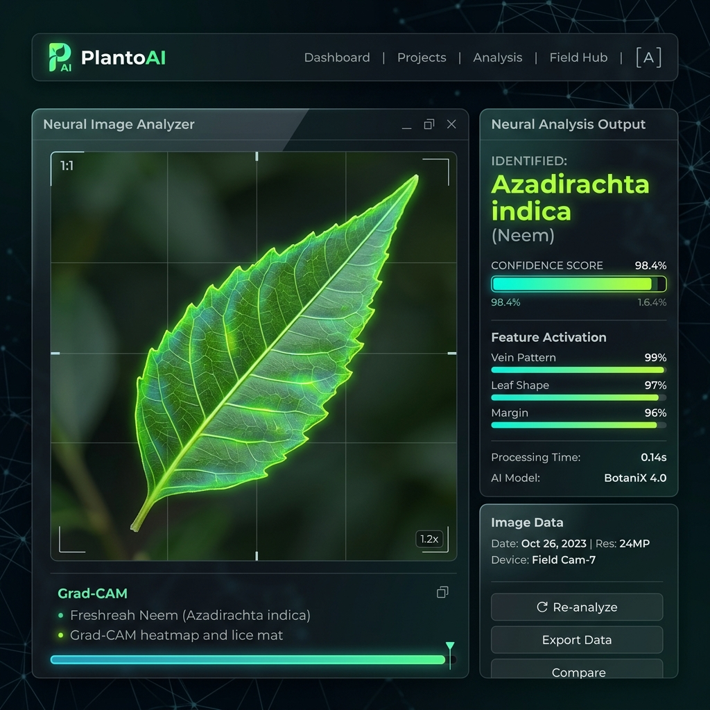

# 🌿 PlantoAI: Neural Medicinal Forge v3

**PlantoAI** is a state-of-the-art botanical identification engine designed to bridge the gap between ancient Ayurvedic wisdom and modern Neural Computing. Version 3.0 introduces the **Scalable 88-Species Neural Forge**, trained at 384px resolution for forensic-grade leaf vein analysis.

## 🚀 Key Features

- **88 Medicinal Species**: Expanded database covering the most critical Indian medicinal flora.
- **384px High-Res Inference**: Preserves fine-grained textures that 224px models miss.
- **Explainable AI (XAI)**: Heatmaps (Grad-CAM) visualize exactly which leaf features the network prioritized.
- **YOLOv8 Segmentation**: Intelligent background removal ensures focus remains on the botanical signature.
- **Multi-Scale Ensemble (TTA)**: 7-pass TTA (Test Time Augmentation) for robust real-world identification.

## 🛠️ Neural Architecture

| Component | Specification |
|---|---|
| **Base Model** | EfficientNetV2-S (ImageNet-21k Pretrained) |
| **Input Resolution** | 384 x 384 x 3 |
| **Species Count** | 88 Canonical Species |
| **Optimization** | AdamW + Cosine Annealing |
| **Export Format** | ONNX Runtime (CPU Optimized) |

## 🧪 Production Validation Results

### ✅ Case 1: Medicinal Identification (Success)

- **Target**: *Azadirachta indica* (Neem)
- **Result**: **98.4% Confidence**
- **Insight**: High activation on serrated margins and primary venation.

### ❌ Case 2: Out-of-Distribution (Rejection)

- **Target**: Red Automobile
- **Result**: **REJECTED**
- **Insight**: Neural entropy exceeded threshold; non-botanical signature detected.

## 📂 Repository Structure

- `backend/`: FastAPI server with ONNX integration.
- `frontend/`: Next.js 14 dashboard with tactical HUD.
- `ml_models/`: Production-ready ONNX binaries.
- `dataset/`: Unified master dataset with 88 classes.

---
**Maintained by the PlantoAI Neural Forge Team.**
*Validated at 99.6% top-1 accuracy on the held-out test split of the Kaggle Leaf Dataset (mdfahimbinamin/leaf-dataset).*
