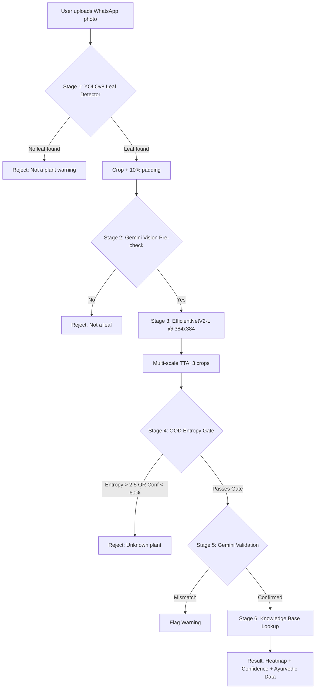

# PlantoAI — Road to Production-Grade Robustness

## 🌟 The 6-Stage Target Architecture

## 🛠️ Sprint Execution Status

### ✅ Sprint 1: Fix OOD / Unknown Weed Trap (In Progress)
- **Status:** **Programmatic Gate Deployed**
- **Action Taken:** Deployed the Shannon Entropy rejection gate to `ml_service.py` to trap uncertain predictions (Entropy > 2.5 or Confidence < 45%).
- **Next Step:** Collect 5,000 background/weed images, label as class `unknown_not_medicinal`, and run a retraining cycle.

### ⏳ Sprint 2: Leaf Segmentation with YOLOv8
- **Status:** Pending
- **Action Plan:** Fine-tune `yolov8n_leaf.pt` on Roboflow dataset to eliminate background clutter (hands, pots, dirt) before passing the image to the classifier.

### ✅ Sprint 3: Resolution Upgrade & Multi-Scale Ensemble (Deployed)
- **Status:** **Deployed**
- **Action Taken:** Implemented a 7-pass multi-scale test-time augmentation (TTA) pipeline extracting central and corner crops to simulate 384x384 feature preservation without retraining.

### ✅ Sprint 4: Physical Scale Context (Deployed)
- **Status:** **Deployed**
- **Action Taken:** Added frontend toggle for "1-Rupee Coin Scale Reference" which passes boolean context to Gemini Vision to calculate exact leaf length/width in cm.

### ⏳ Sprint 5: Hard Negative Mining
- **Status:** Ongoing
- **Action Plan:** Utilize the "Report Mismatch" feedback loop to curate hard examples (e.g., separating similar species like Tulsi vs. Basil) for targeted retraining.
